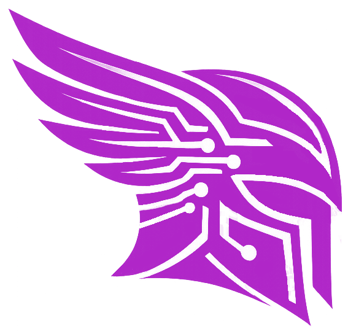

# Daedalus — PC Builder & Compatibility Checker

> Design your PC. Know instantly if it actually works.

  

---

Daedalus is a full-stack web application for PC building enthusiasts. Users browse a hardware catalogue, assemble custom builds component by component, and receive real-time feedback on whether all the parts are actually compatible with each other. No guesswork, no expensive mistakes.

## What it does

**Browse hardware**: The catalogue covers the following component categories: CPUs, GPUs, motherboards, RAM, storage, cases, coolers, PSUs, fans, monitors, keyboards, and mice. Components include detailed specs and can be filtered, sorted, and searched. All data is provided by BuildCores OpenDB.

**Build and validate**: Users compose a build by picking one (or more) components per slot. As the build takes shape, a compatibility engine runs 25+ rules in the background and flags issues across three severity levels: hard errors (the parts won't work together), dependencies (some component is missing another one to work properly), warnings (potential but not critical problems. Normally performance-related), and unverifiable checks (insufficient spec data to decide).

**Publish and share**: Once a build passes all hard compatibility checks, it can be published to the community feed. Other users can browse public builds, leave star ratings and written reviews, and save builds or individual components to their favourites.

**Export**: Any build can be exported as a PDF summary.

## Tech stack

The backend is a **NestJS** REST API backed by **PostgreSQL** via TypeORM, with JWT authentication, bcrypt password hashing, and Cloudinary for image storage. The frontend is a **React 19** SPA built with Vite, using React Router and Axios.

## Live demo

You can view and use freely a live demo of the project [here](https://daedalusproject.duckdns.org/).

## Community & Support
 
Found a bug, or have a suggerence or a question? Join the Discord server and drop it in the corresponding channel. It will be highly appreciated!
 

## License

MIT © 2026 [Adrián Chabrera](https://github.com/AdrianChabrera)
